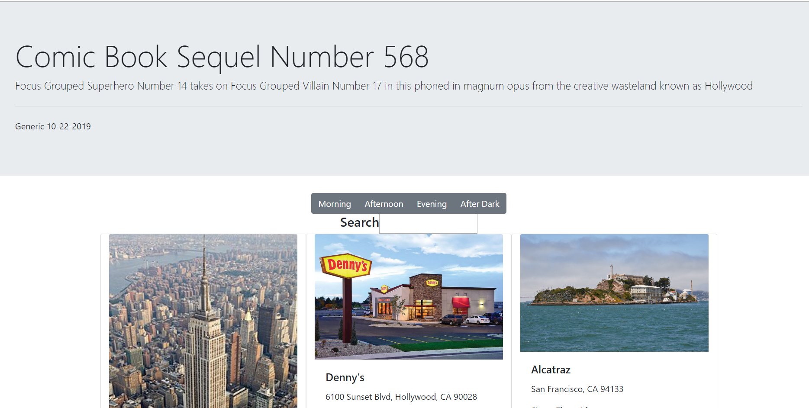

# Shotz

This is an information website about an amazing upcoming movie.  It was built as an exploration of using jquery to read and edit the DOM.

## Screenshots


## How to run this project
* Use npm to install http-server in your terminal:
```sh
npm install -g http-server
```
* Run the server
```sh
hs -p 9999
```
* Open chrome and navigate to:
```
localhost:9999
```
* Use the time of day buttons to filter locations by shoot time.  Typing in the search bar will filter locations to match the search text in either address or name.